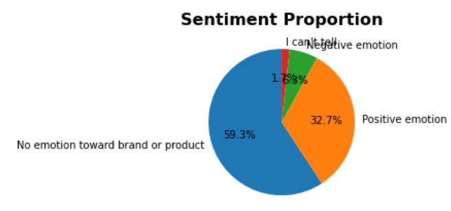
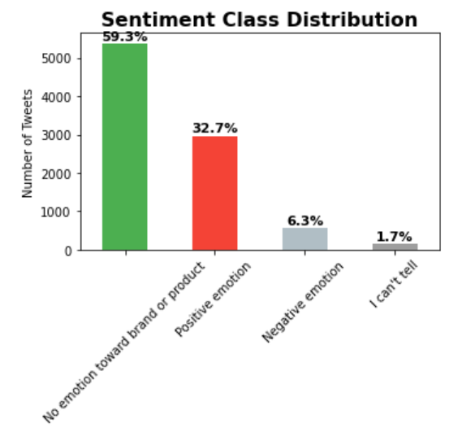
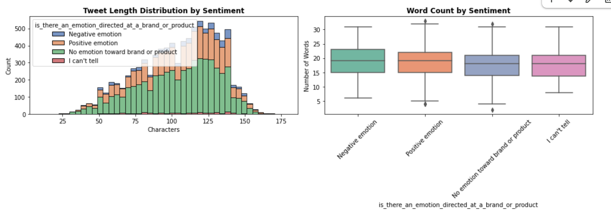
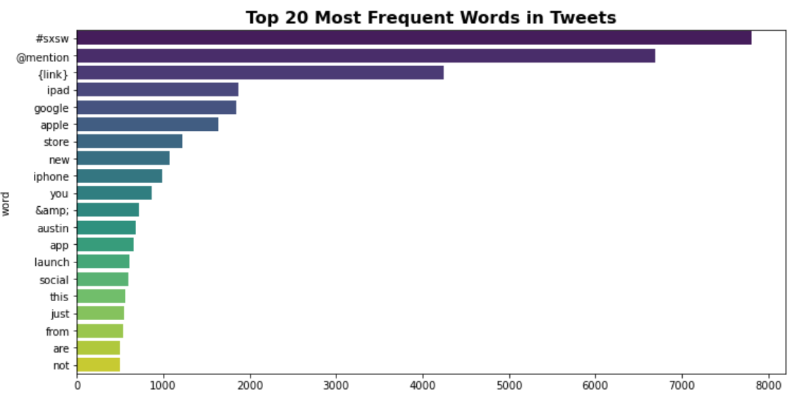
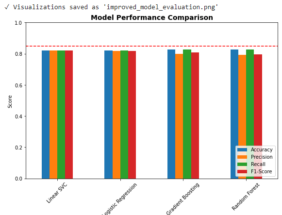
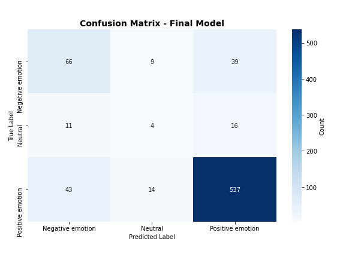
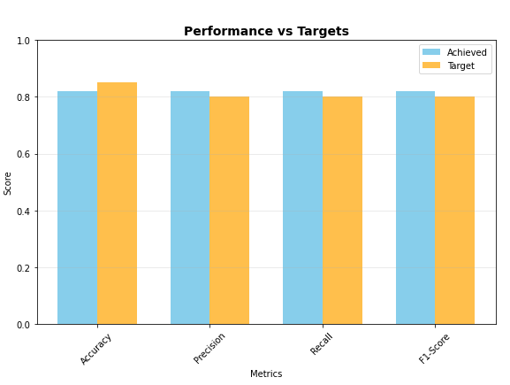

# Sentiment Analysis of Tweets About Apple & Google Products
### Group 8 – Phase 4

**Group Members**
- Sharon Nyakeya
- Priscillah Giriama
- Fatuma Tari
- Michelle Maina
- Barclay Koin

## 1. Introduction
Apple and Google are widely discussed on social media. This project builds an NLP model to classify tweets as positive, negative or neutral, enabling automated brand sentiment monitoring and supporting product and customer teams.

## 2. Business Understanding
Build a comprehensive sentiment analysis system for tech brand mentions on social media, built using the CRISP-DM methodology. This project classifies emotions (Positive/Negative/Neutral) toward brands like iPhone, iPad, Google, and various apps.

### Goal

1. Monitor brand sentiment
2. Detect crises early
3. Generate insights for marketing and product teams

### Success Criteria
1. Understand customer sentiment toward tech brands/products
2. Enable real-time sentiment monitoring
3. Provide actionable insights for brand management
4. Achieve above 80% accuracy with F1-score above 0.80

## 3. Data Overview
~9,000 tweets from CrowdFlower. Filtered to Positive, Negative, I can't tell labels for modeling.
- Source: CrowdFlower (via data.world)
- Size: ~9,000 tweets
- Labels: Positive, Negative, No emotion, I can’t tell
- Final Modeling Labels: Positive, Negative
Key Columns: tweet_text, sentiment label

## 4. Target Audience
Business (Marketing, Product, Support) and Technical (DS, ML Engineers, Analysts).

## 5 Narrative Arc

### 5.1 Problem
Businesses need a scalable way to understand customer sentiment on social media.

### 5.2 Exploratory Data Analysis
Steps taken in the EDA process

**Data Cleaning**

**1. Label Distribution**

- The dataset originally contained four sentiment labels (Positive, Negative, No emotion, I can’t tell).
- Most tweets were “No emotion” or unclear, so the project focused on Positive, Negative and Neutral for a clean multicalss classification task.

**2. Tweet Length & Structure**

- Positive tweets tended to be shorter and more direct.
- Negative tweets were often longer and more detailed.

**3. Punctuation & Emphasis Patterns**

- Negative tweets frequently contained:
    - More exclamation marks (!!!)
    - More question marks (???)
    - More ALL CAPS words
- These behaviors reflect emotional intensity and frustration.

**4. Vocabulary Differences**

- Positive tweets used words like love, amazing, great.
- Negative tweets used hate, issue, problem, bad.
- Word clouds and n-gram analysis confirmed distinct language patterns.

**5. Noise & Duplicates**

- Duplicate tweets were removed.
- Noise such as URLs, emojis, and mentions required cleaning.

**6. Key Insights**

- Both what users say (vocabulary) and how they say it (punctuation, capitalization) signal sentiment.
- These insights justified:
    - TF-IDF vectorization for text
    - Numeric features for emotional indicators
    - SMOTE balancing
    - Choosing linear models for high-dimensional text

We explored:

**1. Sentiment label distribution**

**What this tells us:**

The dataset is heavily imbalanced. Most tweets do not express any emotional sentiment. 
Only 6.3% of tweets express negative sentiment, meaning the negative class is extremely underrepresented.
The low proportion of unclear ("I can't tell") tweets suggests these add little value and mostly create noise.

**2. Tweet Length Distribution by Sentiment**

**What this tells us**

- Users tend to write longer tweets when expressing complaints, explaining why negative tweets tend to be wordier.
- Positive tweets are often short expressions of excitement or approval.

Tweet length is a useful numeric feature for classification.

**3. Word Count by Sentiment**

**What this tells us**

- Negative tweets require explanation, leading to higher word counts.
- Positive and neutral tweets are concise, making their structures easier to model.
Word count is a valuable indicator of sentiment type.

### 5.3 NLP Pipeline Development
We built a preprocessing system that:

    - Cleans tweets
    - Tokenizes and lemmatizes
    - Handles noise (mentions, URLs, emojis)
    - Produces clean text for modeling

### 5.4 Feature Engineering & Modeling

We design features that help the model learn sentiment patterns:

    - TF-IDF captures contextual words and phrases
    - Numeric features capture expressions of emotion
    - SMOTE corrects training imbalance
    - A train/test split ensures fair evaluation

We then train multiple models:

    - Logistic Regression (Baseline model)
    - Linear SVC
    - Random Forest
    - Gradient Boosting
    - XGBoost

### 5.5 Model Evaluation & Interpretation
We analyzed:
- Accuracy, Recall, F1
- Cross-validation stability
- Confusion matrix
- Top predictive features

This ensured the model was reliable and explainable.

## 6 Findings

### 6.1 Data Findings
#### 6.1.1 Data Patterns
- Original dataset was imbalanced; filtering to Positive,Negative and Neutral plus SMOTE improved fairness.
#### 6.1.2 Linguistic Behavior
- Negative tweets: more punctuation, all-caps, complaint terms.
- Positive tweets: shorter, straightforward praise.
#### 6.1.3 Feature Engineering Impact
- TF-IDF + numeric emotion features significantly improved model accuracy.
#### 6.1.4 Model Performance
- Linear SVC and Logistic Regression outperformed tree-based models.

### 7 Summary of Error Analysis

The majority of errors stem from:

- Sarcasm

- Mixed emotions

- Vague statements

- Slang/emoji-driven sentiment

- Structural ambiguity

These limitations are common in classical NLP models and can be resolved using modern transformers and richer feature extraction.

### 8.2 Business Findings
#### 8.2.1 Can we automatically detect sentiment in Apple/Google-related tweets?

The project demonstrates that sentiment can be reliably classified using a machine learning model trained on cleaned and processed tweets. After building a full NLP pipeline and evaluating several models, the Linear SVC and Logistic Regression achieved strong performance with high F1-scores and consistent cross-validation results.

This confirms that automated sentiment detection is feasible and effective for this domain, and can be used at scale to monitor public opinion on Apple and Google products.

#### 8.2.2 What patterns and signals best predict sentiment in tweets?
The analysis identified multiple linguistic and behavioral patterns:

Vocabulary clues:
     - Positive: love, amazing, great, best, awesome
     - Negative: hate, issue, problem, bad, broken

Writing-style clues:
    Negative tweets tend to include:
        - More exclamation marks (!!!)
        - More question marks (???)
        - More capital letters for emphasis

    Positive tweets are generally:
        - Shorter
        - More straightforward
        - Less emotionally intense

    Structural sentiment cues:
        - Sentiment-bearing words from lexicon features (e.g., count of positive/negative words)
        - Ratios of positive vs negative terms
        - Presence of repeated characters or emotional punctuation

These findings show that both what people say and how they say it are strong predictors of sentiment.

#### 8.2.3 Which machine learning model delivers the highest performance for analyzing short, informal text such as tweets?

Across all models tested, the Linear SVC (Accuracy of 80% anf F1-Score of 0.82 )and Logistic Regression which was on baseline model consistently outperformed others.

Reasons why linear models performed best:
- TF-IDF text data is high-dimensional and sparse, ideal for linear classifiers
- Tree-based models struggle with this type of data because:
    - They require dense features
    - They do not naturally leverage n-grams
    - They often overfit on sparse matrices

Model strengths:
- Linear SVC: best overall F1-score and stability
- Logistic Regression: highly interpretable, competitive performance

This aligns with established NLP research showing that classical linear models are extremely effective for short-text classification.

#### 8.2.4 How can sentiment insights support real business decisions?

For Marketing & Brand Teams:
    - Track daily and weekly sentiment trends around product launches or announcements
    - Measure brand health in near-real time
    - Evaluate public response to campaigns or updates

For Product & UX Teams
    - Identify recurring issues mentioned in negative tweets (battery, UI, updates, crashes)
    - Understand which features or products generate positive reactions
    - Prioritize bug fixes and improvements based on user feedback patterns

For Customer Support:
    - Detect early spikes in negative sentiment that may indicate:
    - Service outages
    - Update-related problems
    - Unexpected product defects

For Executive Decision-Making
    - Provide a data-driven view of public perception
    - Support risk mitigation strategies
    - Strengthen customer engagement planning

Overall, the model enables organizations to respond faster, prioritize better, and understand users more deeply.

## 9 Recommendations
### 9.1 Business Recommendations
1. Use the model for real-time brand sentiment monitoring

This would allow marketing and communications teams to track spikes in praise or complaints around product launches, outages, or major updates.

2. Support product development decisions

By identifying the most common positive and negative themes, product teams can prioritize feature improvements or address recurring issues.

3. Enable early-warning alerts for negative sentiment

Negative spikes often correlate with bugs, service outages, or controversial changes. Alerts would enable customer support teams to act quickly.

